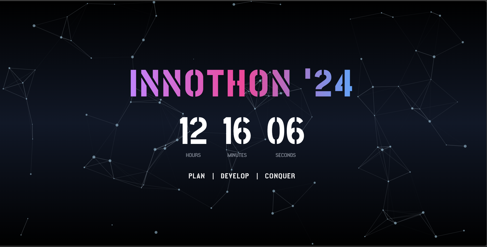

# ⏳ **INNOTHON '24 Timer**  

  

Welcome to the **INNOTHON '24 Timer** 🎉! This is a sleek and attractive countdown timer built using **React** with a dynamic **particle background** for that extra visual flair 🌌. Plan your projects, stay on track, and hit your goals with **Plan | Develop | Conquer** 💪!  

---

## 🚀 **Features**  
✨ **Real-time Countdown:** Never miss a moment with second-by-second updates.  
🌌 **Interactive Particle Background:** Makes the UI fun and engaging.  
📱 **Responsive Design:** Works smoothly across all devices — mobile, tablet, and desktop.  
🎨 **Gradient Text Effects:** Beautiful and eye-catching titles and headings.  

---

## 🛠️ **Tech Stack & Dependencies**  
This project is built with:  

```json
"dependencies": {
    "@tsparticles/react": "^3.0.0",
    "react": "^18.3.1",
    "react-dom": "^18.3.1",
    "react-tsparticles": "^2.12.2",
    "tsparticles": "^3.5.0"
}
```

---

## 📸 **Screenshots**  
Here’s a quick peek at the **INNOTHON '24 Timer** in action:  

  

---

## 🔧 **How to Run the Project Locally**  

Follow these steps to set it up and run locally:  

1. **Clone the repository**  
   ```bash
   git clone https://github.com/johnwesley755/Timer.git
   cd Timer
   ```

2. **Install dependencies**  
   Make sure you have Node.js installed, then run:  
   ```bash
   npm install
   ```

3. **Start the development server**  
   ```bash
   npm run dev
   ```  
   Your app will be live at [http://localhost:5173](http://localhost:5173) 🚀  

---

## ⭐ **Support the Project**  
If you find this project helpful or inspiring, don’t forget to **star the repo** 🌟!  
Your stars motivate me to keep improving this project 🙌.  

---

## 🎯 **Usage**  
This timer is perfect for events like hackathons, countdown applications, or any time-bound challenge. Just adjust the starting time, and you’re ready to go!  

---

## 🤝 **Contributing**  
Feel free to fork this repository, suggest improvements, and open a pull request. All contributions are welcome and appreciated 🙌!  

---

## 🎉 **Thank You for Visiting!**  
Enjoy coding, stay motivated, and make every second count ⏲️!  
Made with ❤️ by [John Wesley](https://www.linkedin.com/in/john-wesley-6707ab258/).  

---
